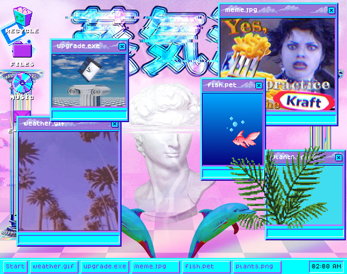

# App Preview

## Table of contents
* [General info](#general-info)
* [Technologies](#technologies)

## General info
Just a bit of fun with jQuery. This is a mostly aesthetic project I made while playing around with the different functions available through jQuery, styled to look like a Windows 98 desktop. You can view it at [https://tempesttypist.github.io/vaporwave-desktop/](https://tempesttypist.github.io/vaporwave-desktop/)
	
## Technologies
Project is created with:
* CSS
* jQuery